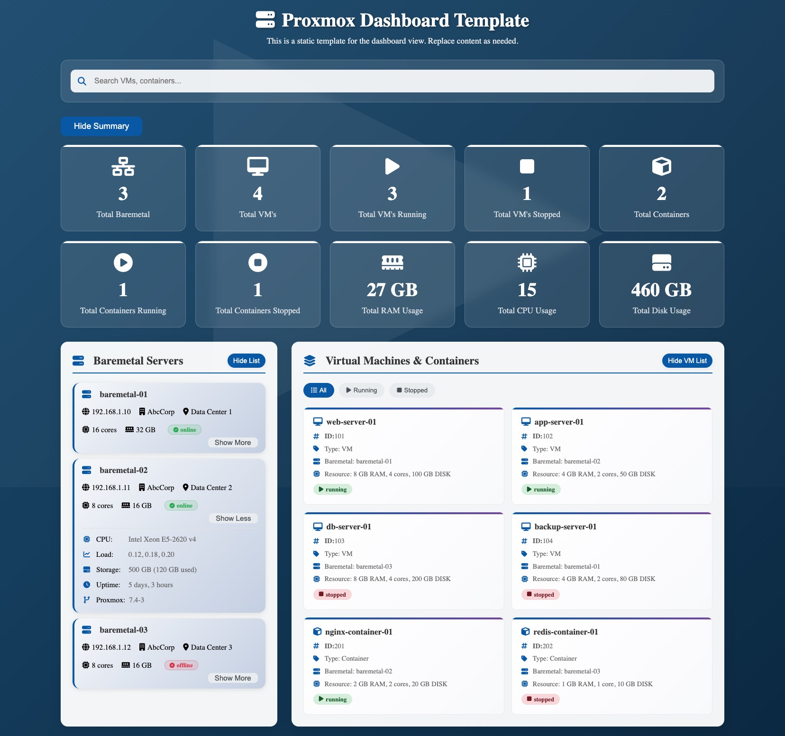

# ProxmoxVE Watcher

A modern, responsive web dashboard for managing and monitoring Proxmox Virtual Environment (PVE) infrastructure. Built with Vue.js frontend and Python Flask api.

## ⚡ Built with [Cursor AI](https://cursor.sh/) · Design Inspired by [Claude AI](https://claude.ai)

This project was **designed with inspiration from [Claude AI](https://claude.ai)** — an AI assistant/chatbot known for its conversational capabilities and natural language understanding — and **developed using [Cursor AI](https://cursor.sh/)**, an AI-first code editor tailored for developers.

## 🌟 Features

- **Real-time Monitoring**: View all VMs and containers across multiple Proxmox hosts
- **Interactive Dashboard**: Search, filter, and sort your virtual infrastructure
- **Multi-Node Support**: Monitor multiple Proxmox clusters from a single dashboard
- **Advanced Sorting**: Sort by name, ID, uptime, and status across all views
- **Node Selection**: Filter resources by specific Proxmox nodes
- **Responsive Design**: Modern UI with Tailwind CSS that works on all devices
- **Docker Support**: Easy deployment with Docker and Docker Compose
- **Resource Overview**: Detailed stats on CPU, RAM, storage, and system status

## 🚀 Quick Start

### Option 1: Docker (Recommended)

The fastest way to get started is using Docker:

```bash
# Clone the repository
git clone https://github.com/nurawiguna/ProxmoxVE-Watcher
cd ProxmoxVE-Watcher

# Quick start with the helper script
./docker-start.sh

# Or manually with docker-compose
docker-compose up -d
```

**👉 For detailed Docker setup instructions, see [DOCKER.md](DOCKER.md)**

### Option 2: Manual Setup

## 📋 Requirements
- **Python 3.10+** (tested on 3.10.0)
- **Node.js 18+** (for frontend development)
- **Python packages:** Flask, Flask-CORS, proxmoxer, python-dotenv
- **Node packages:** Vue 3, Vite, Tailwind CSS, Pinia

### 1. Clone the Repository
```bash
git clone https://github.com/nurawiguna/ProxmoxVE-Watcher
cd proxmox-watcher
```

### 2. Backend Setup (with Python Virtual Environment)
```bash
cd api
python3 -m venv venv
source venv/bin/activate  # On Windows use: venv\Scripts\activate
pip install -r requirements.txt
```

#### Configure Proxmox Hosts
Edit `api/proxmox_hosts.json` and add your Proxmox hosts (see example in file).

### 3. Run the Backend
```bash
python app.py
```
- The api runs at [http://localhost:5000](http://localhost:5000)

### 4. Frontend Setup & Run
```bash
cd ../frontend
python3 -m http.server 8000
```
- The frontend will be available at [http://localhost:8000](http://localhost:8000)

---

## 🔐 Permissions Setup (Proxmox)
1. **Create a User** in Proxmox (Datacenter > Permissions > Users).
2. **Create a Role** (if needed) with at least these privileges:
   - `Sys.Audit`, `VM.Audit`, `VM.Monitor`
3. **Assign Permissions**:
   - Go to Datacenter > Permissions > Add
   - Path: `/`
   - User: your API user
   - Role: your custom role or `PVEAdmin` (for testing)

---

## 📖 Usage
- Open the frontend in your browser at [http://localhost:8000](http://localhost:8000)
- Use the dashboard to view, filter, and search VMs/containers
- Click a node to filter by node, use the search bar or filter buttons
- Use the toggle buttons to show/hide different sections
- Monitor real-time status and resource usage across your infrastructure

---

## ⚠️ Important Notes
- Ensure your machine can reach all Proxmox hosts via network and API
- Credentials in `proxmox_hosts.json` must be valid and have API access
- For production deployments, secure your credentials and use HTTPS
- If your Proxmox server uses a self-signed certificate, you may need to set `"verify_ssl": false` in your host config
- **⚠️ Disabling SSL verification is insecure and should only be used for local/testing purposes**

---

## 🤝 Contributing

We welcome contributions from the community! To contribute:

1. **Fork the repository** to your GitHub account
2. **Create a new branch** for your feature or bugfix:
   ```bash
   git checkout -b feature/your-feature-name
   # or
   git checkout -b bugfix/your-bugfix-name
   ```
3. **Make your changes** and test thoroughly
4. **Commit your changes** with descriptive commit messages:
   ```bash
   git commit -m "feat: add new monitoring feature"
   ```
5. **Push to your branch**:
   ```bash
   git push origin feature/your-feature-name
   ```
6. **Create a Pull Request** to the main repository

### 📝 Contribution Guidelines
- Follow the existing code style and conventions
- Add comments for complex logic
- Test your changes thoroughly
- Update documentation if needed
- Use conventional commit messages (feat, fix, docs, style, refactor, test, chore)

---

## 📜 License & Attribution

This project is licensed under the **MIT License** - see the [LICENSE](LICENSE) file for details.

### 🙏 Attribution Required
If you use this project in your work, please provide attribution by:
- Keeping the original license and copyright notice
- Mentioning this repository in your documentation or credits
- Linking back to: [Proxmox VE - Watcher](https://github.com/nurawiguna/ProxmoxVE-Watcher)

**Example attribution:**
```
Based on Proxmox VE - Watcher by Nura Wiguna
https://github.com/nurawiguna/ProxmoxVE-Watcher
```

### 🔄 Free to Use
- ✅ Use for personal and commercial projects
- ✅ Modify and adapt to your needs  
- ✅ Distribute and share
- ✅ Create derivative works
- ❗ **Must include attribution and original license**

---

## 📧 Support & Contact

- **Issues**: [GitHub Issues](https://github.com/nurawiguna/ProxmoxVE-Watcher/issues)
- **Discussions**: [GitHub Discussions](https://github.com/nurawiguna/ProxmoxVE-Watcher/discussions)
- **Author**: [Nura Wiguna](https://github.com/nurawiguna)
- **Buy Me a Coffee**: [Nura Wiguna](https://coff.ee/nurawiguna)
<p align="center">
   <a href="https://coff.ee/nurawiguna">
      
   </a>
</p>


---

## 📸 Screenshot Template Overview


*Modern, responsive dashboard interface for managing Proxmox infrastructure*

--- 
